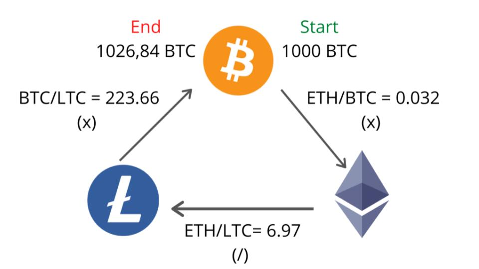
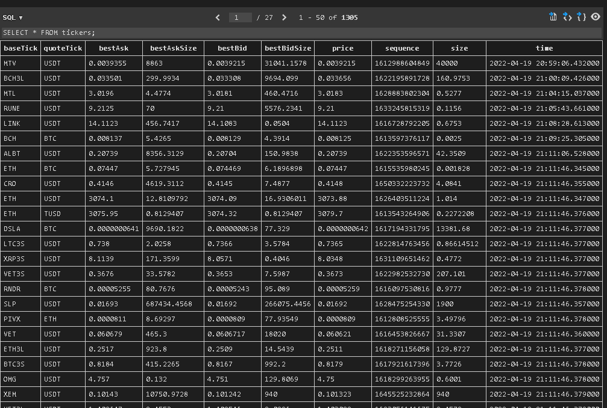

# Report

## Abstract

The purpose of this study is to create a crypto arbitrage bot which allows users to execute automated trades. Triangular arbitrage is chosen as the arbitrage method, so the aim is to take advantage of the price differences between three different pairs. Kucoin, and Gemini are chosen exchanges for this project. The Bellman-Ford algorithm is used for decision making which computes the shortest path in a single source vortex. Other than triangular arbitrage, price prediction is done in this project for different coins' prices by using Sarimax, Autorima, and Nbeat models.

## Introduction

Arbirtrage is buying an asset on an exchange and selling it at another exchange for a higher price. It is a very straightforward process for traders. When a stock's price is lower on a foreign exchange, they buy it from there and sell it on the local exchange. The price on the foreign exchange is considered as "undervalued" because there are delays in adjusting the prices on different exchanges. However, detecting arbitrage opportunities is a very hard work, taking advantage of them is even harder. Trading arbitrage opportunities manually is almost impossible because they occur and dissappear in seconds. For that reason, it requires advanced programs and computer equipments to automate this process. There are already numerous programs in every exchange which tries to take advantage from these discrepancies. There are different types of arbitrages like pure arbitrage, merger arbitrage, triangular arbitrage, etc. In this project, triangular arbitrage is studied and applied in crypto market. If a disparity between three foreign currencies happens when their exchange rates do not exactly line up, resulting in triangular arbitrage. In other words, triangular arbitrage exploits market inefficiencies, and help market to become efficient. Below example shows how the triangular arbitrage works between the fiat currencies EUR, USD, and GBP.

Example for triangular arbitrage:
_Suppose you have $1 million, and you are provided with the following exchange rates: EUR/USD = 1.1586, EUR/GBP = 1.4600, and USD/GBP = 1.6939. With these exchange rates there is an arbitrage opportunity:_
_Sell dollars to buy euros: $1 million ÷ 1.1586 = €863,110_
_Sell euros for pounds: €863,100 ÷ 1.4600 = £591,171_
_Sell pounds for dollars: £591,171 x 1.6939 = $1,001,384_
_Subtract the initial investment from the final amount: $1,001,384 – $1,000,000 = $1,384_
_From these transactions, you would receive an arbitrage profit of $1,384 (assuming no transaction costs or taxes)._
_(Source: <https://www.investopedia.com/terms/t/triangulararbitrage.asp>)_

Triangular arbitrage is widely studied before from different aspects mostly in foreign exchange trading platforms. People practice triangular arbitrage between fiat currencies like the example above. While the analysis of Aloosh and Bekaert (2017) aims at controlling for the triangular arbitrage, our project tries to charactrize and take advantage from arbitrage opportunities. Another research from Piccotti (2018) uses 5-minute period in his quote revisions, while our project tries to detect arbitrage opportunities in miliseconds. Speed is important while trading arbitrage, but in crypto world it is even more essential. The crypto market's volatility is extremely higher than foreign exchange market, thus working with shorter time intervals is necessary. Another constraint to trade arbitrage opportunities is their decreasing number over the years. According to the examination of time series data from 1999 to 2009, it is found that there is a decrease in the number of triangle arbitrage possibilities (Ito, 2012). This is expected and can be normalized because the market becomes more efficient over the years with the advancement of the technology. However, it is never perfect, so there is still room for users to take advantage from discrepencies.

There has been much other research about market discrepancies and arbitrage trading. Different methods and various types of models have been used to trade arbitrage opportunities. Gebarowski et al. (2019) aimed to show the prediction power of q-detrended cross-correlation coefficient stemming when it is practiced over historical time series of exchange rates for certain currencies in their research. They investigated how financial markets create arbitrage opportunities by analyzing the delicacy of different statistical properties. Another study from Lin et al. (2011) analyzed cross-correlations in the stock exchange via using time-delay variant of DCCA (detrended cross-correlation analysis) method.

In research from Gradojevic et al. (2020) it is found that high frequency traders' movements are supported by triangle arbitrage, which occurs in a milisecond trading environment. In their study, they used wavelet-based regression approach that allowed them to find 80-100 arbitrage opportunities in a day in Foreign Exchange (FX). Expectedly, these aberrations are brief, lasting between 100 and 500 milliseconds. The average profit ranged between 0.5 and 0.75 basis points. However, as mentioned earlier the volatility in the cryptocurrency market is higher. In our model, we were able to detect 3 different arbitrage opportunities in a minute. When we ran our model, we observed ... arbitrage opportunities which have a higher profit rate than 0.1%. The same study from Gradojevic et al. (2020) suggests that currencies with low cross-correlation with others tends to have higher profit rates in arbitrage opportunities. Another research from Knif et al. (1995) uses frequency-embedded spectral approach to investigate the connection between two European stock exchanges. They found that the market dependence can be described in a manageable way by using multiscale resolution of stock market performance and volatility.

### What is a Crypto Trading/Arbitrage Bot?

Automated trading started in 1980s. It has been used and developed since then by institutional investors and large trading firms for different purposes. It is also known as algorithmic trading by investors. Nowadays algorithmic trading composes 60-70% of the total equity trades in the US market. It is 100% legal, and very preferable by users due to its ability for high frequency trading. The investors are able to trade 7/24 with the help of these computer programs without spending days and nights on their computers. Once they setup their parameters, the program is ready to execute trades on selected currencies. The first product invented for this purpose was Automated Trading Desk (ATD). MacKenzie (2016) explains that ATDs were primarily automated marketmakers in his research. They were invented to replace NYSE specialists whose role is to buy an asset from a given price and sell it for a higher price. Nevertheless, relying on people makes this process slow, and it is very fragile against human mistakes. While ATDs make this process a lot faster and better, they are not considered as the official marketmakers.

Trading bots can be considered a type of ATDs. They are computer programs that are programmed to automatically execute buy and sell orders on an exchange based on a trading strategy. There are various service providers on the market not just for trading but for arbitrage trading too. Users can either choose an in-built trading strategy or make their own with their favorite indicators and currency pairs. Arbitrage bots have the same concept as the trading bots, but their strategy is based on making profit from price discrepencies. _?For example, Pionex is a crypto trading bot provider which also offers arbitrage bot. Their system is based on opening a hedge position in perpetual futures market on people's spot crypto positions. If a client has $1000 invested Ethereum (ETH) in spot, the bot opens a short position worth of $1000 on ETH-USDT pair. Since long position holders pay a funding fee to short position holders in every 8 hours, their earnings and losses balances each other but the earnings from funding fee is their profit. If the investors hold short positions more than the long positions, this strategy will not work. However, the funding rate (a ratio shows the balance between the long and short positions) is mostly positive, this strategy can make money to the investors especially in bullish market cycles.?_

Triangular arbitrage bots are slightly different than regular arbitrage bots because of the concept of triangular arbitrage. Rather than trading an asset in different exchanges, triangular arbitrage focuses on the selected three currencies and trades them in the same exchange. Multiple opportunities are created in crypto market for triangular arbitrage trading. Due to its high volatility and non-stop market structure, crypto currency market is a gem for most traders.

Triangular arbitrage works in the same logic as in foreign exchange market. It exploits from the market inefficiencies in crypto market. Below example explains how it works:

### Parameters of Our Triangular Arbitrage Bot

In this study, Kucoin exchange is used for analysis. Necessary API keys are generated to gather all the coins' prices in Kucoin. At first, the coin prices were gathered for 5 minutes, and the analysis were made in this dataset. Taker, and maker fees are adjusted to 0.001 according to real fees applied in Kucoin. Fiat unit per trade is adjusted to 50 US Dollars. To avoid small profit margins, minimum percentage of profit margin to display is adjusted to 0.1%. This adjustment was necessary because smaller profit margins get eaten by trading fees, and this can cause the trader to lose money on trades. For that reason, any trade opportunity needs to have at least 0.1% to be executed. The model also calculates two different arbitrage opportunities for given three currencies. These are defined as forward arbitrage, and reverse arbitrage. The model executes the arbitrage opportunity with higher profit margin with the constraint of being more than 0.1%.

## Dataset

Kucoin
Historical Data - Exploratory data analysis
Analysis.py - Live data

## How does our bot work?

In this model there are multiple notebooks generated for different purposes. In this section, we will dive into these notebooks and explain how they work.

### Live.py

Firstly, configuration yaml is loaded and dictionary of setting is returned in this notebook. Then, log files are created with the date stamp added on each file name to clarify them for users. Kucoin API keys are entered here for data collection. After that, the real time coin price data are collected and saved in these log files. The data collected is also used to create tables. In these tables there is information about the coin's best ask price, best bid price, best ask size, date stamp, etc. Below image is an example for these tables.

### Account.py

This notebook monitors spot trades. Each and every change in account balance is displayed to have full knowledge on account balance. The changes and trades are stored in a database.

### Analysis.py

Trade opportunities are filtered depending on their profit rates in this notebook. The pairs are scanned in milliseconds for both forward and reverse trading opportunities. Trade opportunities with 0.1% or greater are going to be executed. Base ticker, quote ticker, best bid price, best ask price, best ask size, best bid size, price, sequence, size, and time columns of each opportunity are displayed. The trade opportunities which satisfy the constraints are executed in trade.py. _?This notebook includes both opportunities from triangular arbitrage, and bellman-ford optimization.?_

### Trade.py

The opportunities detected in analysis.py are executed in this notebook. Trade opportunity with the greater profit rate between forward and reverse arbitrage is executed. If the profit rate is the same, forward arbitrage is executed. After every execution there is a print command "attempted" to continue processing next trade. Even if the opportunity is not executed, there is a print command "attempted". Since the books have already changed, this action is neccessary to avoid losses, and leave that last trade behind.

### Data Flow for This Project

## Price Prediction with Time Series Analysis

Sarima
Arima
NBeat

## Bellman-Ford Algorithm

Analysis
Results

## Comparing the Results of the Models

Triangular Arbitrage Bot vs. Bellman-Ford

## Conclusion

## References

Aloosh, A., & Bekaert, G. (2017). Currency Factors. SSRN Electronic Journal. <https://doi.org/10.2139/ssrn.3022623>

Gębarowski, R., Oświęcimka, P., Wątorek, M., & Drożdż, S. (2019). Detecting correlations and triangular arbitrage opportunities in the Forex by means of multifractal detrended cross-correlations analysis. Nonlinear Dynamics, 98(3), 2349–2364. <https://doi.org/10.1007/s11071-019-05335-5>

Gradojevic, N., Erdemlioglu, D., & Gençay, R. (2020). A new wavelet-based ultra-high-frequency analysis of triangular currency arbitrage. Economic Modelling, 85, 57–73. <https://doi.org/10.1016/j.econmod.2019.05.006>

Ito, T. (2012, November 15). Free Lunch! Arbitrage Opportunities in the Foreign Exchange Markets. NBER. <https://www.nber.org/papers/w18541>

Knif, J., Pynnönen, S., & Luoma, M. (1995). An analysis of lead-lag structures using a frequency domain approach: Empirical evidence from the Finnish and Swedish stock markets. European Journal of Operational Research, 81(2), 259–270. <https://doi.org/10.1016/0377-2217(93)e0321-n>

Lin, A., Shang, P., & Zhao, X. (2011). The cross-correlations of stock markets based on DCCA and time-delay DCCA. Nonlinear Dynamics, 67(1), 425–435. <https://doi.org/10.1007/s11071-011-9991-8>

MacKenzie, D. (2016). A material political economy: Automated Trading Desk and price prediction in high-frequency trading. Social Studies of Science, 47(2), 172–194. <https://doi.org/10.1177/0306312716676900>

Piccotti, L. R. (2018). Jumps, cojumps, and efficiency in the spot foreign exchange market. Journal of Banking & Finance, 87, 49–67. <https://doi.org/10.1016/j.jbankfin.2017.09.007>

A new wavelet-based ultra-high-frequency analysis of triangular currency arbitrage
Detecting correlations and triangular arbitrage opportunities in the Forex by means of multifractal detrended cross-correlations analysis <https://www.geeksforgeeks.org/bellman-ford-algorithm-dp-23/>
